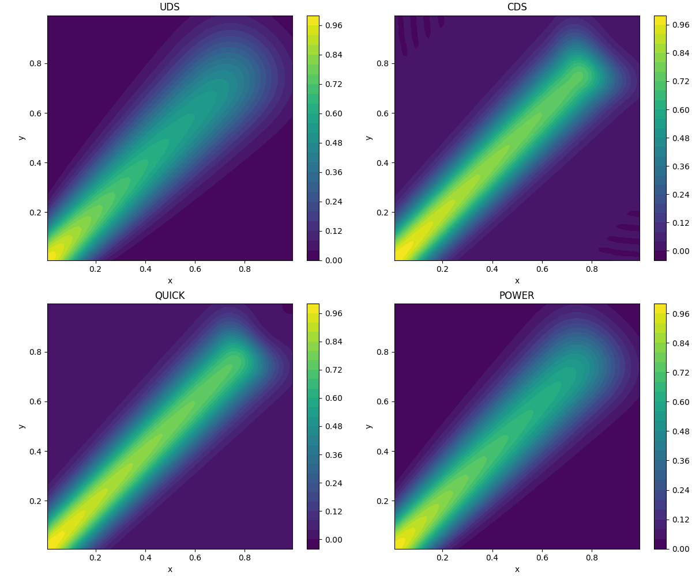
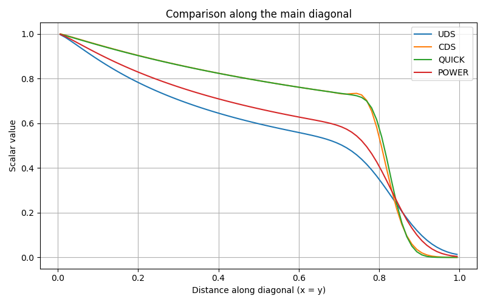

# Example Cases

This section presents simple example cases to illustrate how numerical choices affect CFD results. In particular, it highlights the influence of grid resolution and interpolation schemes on solution accuracy, stability, and numerical diffusion.

## Effect of Grid

The accuracy and efficiency of numerical solutions depend significantly on the grid used for discretization. Different grid resolutions and grid types can affect the quality of the computed solution.

In general:

- finer grids improve resolution of gradients and flow features
- coarser grids reduce computational cost but may introduce larger numerical errors
- grid quality can strongly influence convergence and stability

## Effect of Different Solvers

Different interpolation methods can produce noticeably different results even on the same uniform grid. Their behavior is especially important in convection-dominated problems, where the balance between stability and accuracy becomes critical.

### Interpolation Methods

- **Upwind Differencing Scheme (UDS)**
- **Central Differencing Scheme (CDS)**
- **QUICK Scheme**
- **Power Law Interpolation**

The choice of interpolation method can impact:

- numerical stability
- artificial diffusion
- oscillatory behavior
- sharpness of the transported scalar field

## Python Demonstration

The following example uses a **uniform square grid** with flow entering from the **lower-left corner** and moving diagonally across the domain. It compares the effect of different interpolation methods on the transport of a scalar quantity.

### Source Code

[View Python code](Code/effects.py)

## Output

### Scalar Distribution for Different Interpolation Methods

The figure below compares the scalar field obtained using the different interpolation schemes on the same uniform grid.

### Comparison Along the Main Diagonal

The next figure compares the scalar values along the diagonal of the square domain. This makes it easier to observe the numerical diffusion and sharpness introduced by each interpolation method.

## Observations

- **UDS** is generally stable but introduces more numerical diffusion.
- **CDS** can produce a sharper solution, but may become oscillatory in convection-dominated cases.
- **QUICK** often provides a sharper profile than UDS, though it may overshoot in some situations.
- **Power Law Interpolation** offers a compromise between stability and accuracy.

---

Prev :[Discretization](Discretization.md)
Next :[Meshing Basics](Meshing_Basics.md)
